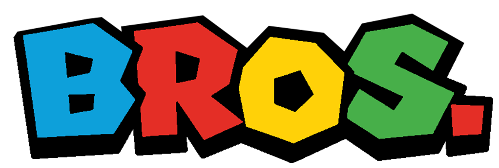
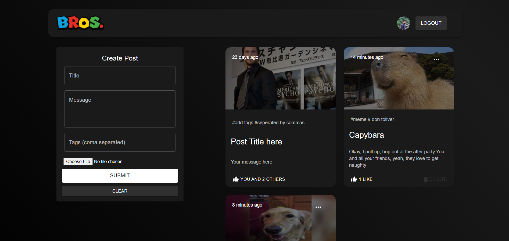
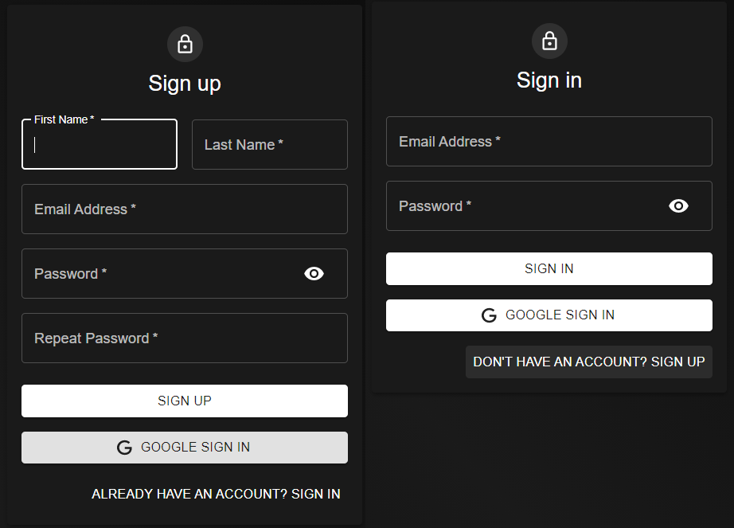

# Bros.

<p align="center">
    
    <br>
 </p>

A Social Media App using React + Redux, Node, Express, MongoDBA complete MERN stack project.

### Tech Stack 📚

<p align="center">
     
     
     
     
     
     <br />
     
     
     
     
</p>



### Google OAuth and JWT Authentication



## Setup

- run ```npm i && npm start``` for both client and server side to start the app
